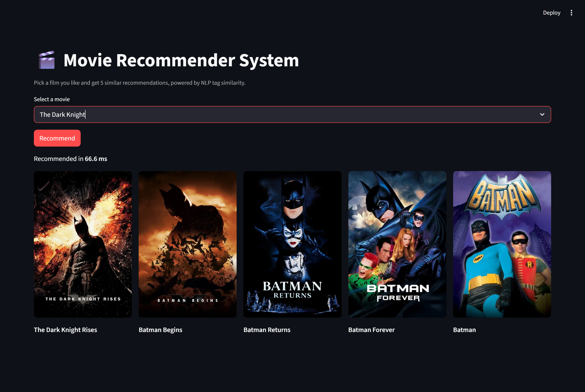

# 🎬 Movie Recommender — NLP Content-Based Engine

A content-based movie recommender that suggests **5 similar films** from any chosen title using
NLP tag vectors and cosine similarity over **4,806 movies**. Built with Python, scikit-learn and Streamlit.

**Live demo:** https://movie-recommender-2431.streamlit.app/



## How it works

1. **Feature engineering** — each movie is described by a `tags` document built from its overview,
   genres, keywords, top-3 cast and director, then lowercased and Porter-stemmed.
2. **Vectorization** — `CountVectorizer(max_features=5000, stop_words='english')` turns each movie's
   tags into a bag-of-words vector.
3. **Similarity** — cosine similarity between every pair of vectors (a 4806×4806 matrix, recomputed
   at startup) ranks the most similar movies; the app returns the top 5 with posters from the TMDB API.

The full pipeline is documented and reproducible in [`notebook.ipynb`](notebook.ipynb), which also
compares `CountVectorizer` vs `TF-IDF`.

## Tech stack

Python · scikit-learn (`CountVectorizer`, `cosine_similarity`) · pandas · Streamlit · TMDB API

## Run locally

```bash
git clone <your-repo-url>
cd Movie_Project
python -m venv venv
venv\Scripts\activate        # Windows  (source venv/bin/activate on macOS/Linux)
pip install -r requirements.txt
streamlit run app.py
```

The similarity matrix is computed from `tags` on first load (~3 s, then cached), so no large
model file is needed.

### TMDB posters (optional)

Posters come from the free [TMDB API](https://www.themoviedb.org/settings/api). Without a key the
app still works and shows placeholder images.

- **Locally:** copy `.streamlit/secrets.toml.example` to `.streamlit/secrets.toml` and set your key.
- **On Streamlit Cloud:** add `TMDB_API_KEY` under **Settings → Secrets**.

The key is read via `st.secrets["TMDB_API_KEY"]` and is never committed.

## Deploy

Deploys free on [Streamlit Community Cloud](https://share.streamlit.io): connect this GitHub repo,
set the main file to `app.py`, add the `TMDB_API_KEY` secret, and deploy. First boot recomputes the
similarity matrix (cached thereafter).

## Project structure

```
app.py             # Streamlit app: recompute similarity, recommend, poster grid
notebook.ipynb     # Reproducible training pipeline (features → vectorize → similarity)
movies_dict.pkl    # 4,806 movies: movie_id_x, title, pre-stemmed tags
requirements.txt   # Pinned dependencies
```

> `similarity.pkl` is intentionally **not** committed — the 184 MB matrix is recomputed from `tags`
> at runtime, keeping the repo lightweight.
